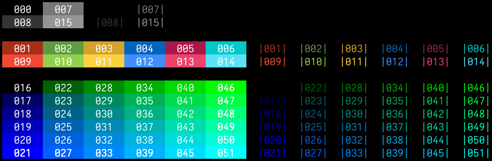

# Colours

[](LICENSE)

Prints xterm colours.



## Usage
By default colours are sorted by RGB value. Use flags for different sorting:

```
$ colours           # Default RGB sorting
$ colours -dist=21  # Sort by distance from colour 21 (valid: 16-231)
$ colours -grey     # Sort by grayscale value
$ colours -harm=21  # Show colour harmonies for colour 21 (valid: 16-231)
$ colours -hue      # Sort by hue (rainbow order) with greys separated
$ colours -lum      # Sort by luminance (brightness)
$ colours -sat      # Sort by saturation (vibrancy)
$ colours -sim      # Sort by visual similarity groups
$ colours -temp     # Sort by temperature (warm/cool)
```

## Installation
```
$ go install github.com/jsageryd/colours@latest
```
